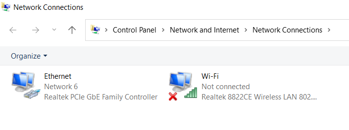
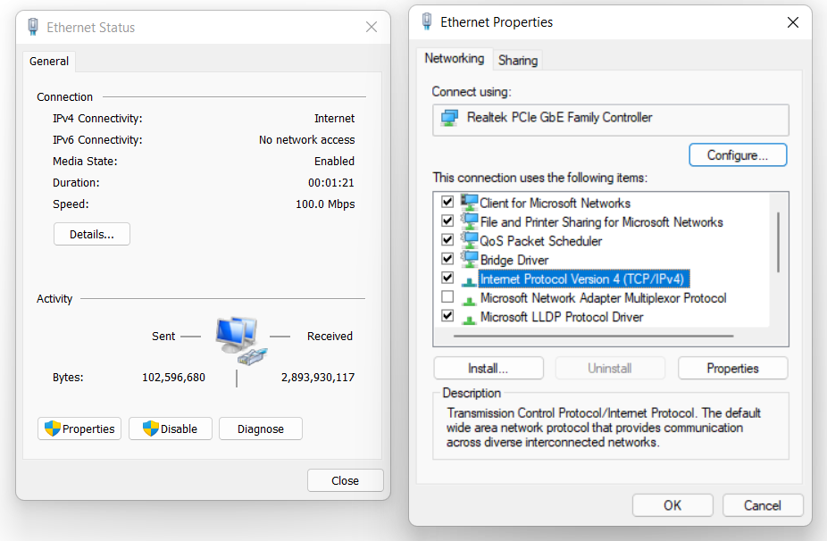
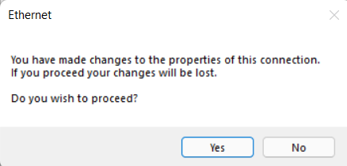
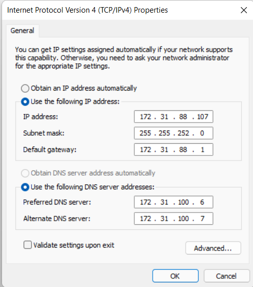
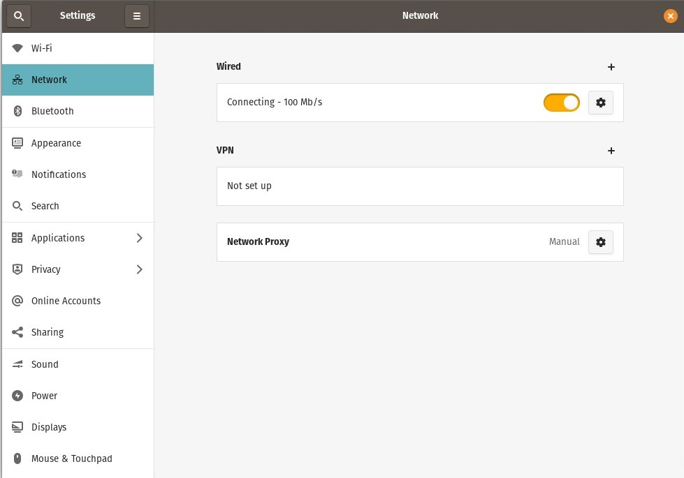
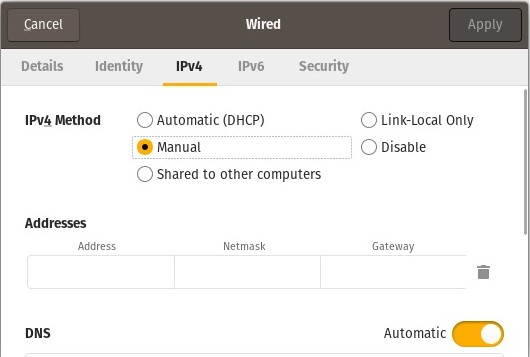
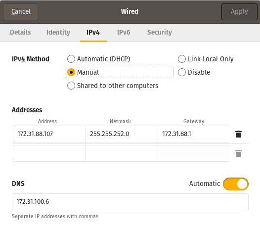
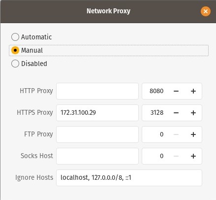

# Lan Configuration Settings

Follow these steps to configure LAN connection in your PC.

## For Windows:

1. Add proxy in system proxy settings [Settings > Network & Internet > Proxy].

2. One way is to use Ethernet Settings page in Network and Internet settings page to set static IP. Alternative way is descibed her: Press _win+R_ key, and type **ncpa.cpl** on the dialog box that appears.

    

        
    

3. A new Window named network connections should open up. Double click on Ethernet Icon.

    

        
    

4. A new Dialog named Ethernet status will pop up. On it click on properties. Find the Internet Protocol Version 4 option as shown in the image and click on properties.

    

        
    

5. A pop up will appear. Click yes.

    

        
    

6. You will get a dialog box as shown in the image below.

    

        
    

7. Find the IP address, subnet mask and default gateway for your room in this [PDF for Tagore hostel](tagore_ip.pdf) or [PDF for Tilak hostel](tilak_ip.pdf). For Preferred and Alternate DNS Server, use the same address as mentioned in the image. Click Ok to save the settings.

 

## For Linux:

> Note - Some settings may vary based on your Distro. This reference uses Pop!_OS (Gnome Desktop Environment).

1. Find Wired Network in Settings and click on the settings icon.

    

        
    

2. A Dialog box similar to below image will show up. Select Ipv4 tab in it. In Ipv4 method choose manual.

    

        
    

3. Find the IP address, subnet mask and default gateway for your room in this [PDF](tagore_ip.pdf). For DNS, use the same address as mentioned in the image. Click Apply to save the settings.

    

        
    

4. Now again click on Network Proxy as shown in step1. Adjust Settings to the same as shown in image below.

    

        
    

## For Router

1. Open your Router settings page by finind the URL on the back of the router.
2. Set IP to static and enter required details. (Where this option is located depends on router manufacturer. Search in Setup > Internet Setup, or in WAN configuration option).

> > Note: These settings apply to Tagore hostel. Other hostels have DHCP support, but static IP configuration might be needed sometimes if IP conflict occurs.

