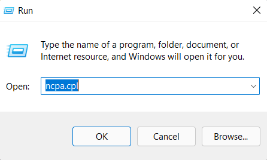
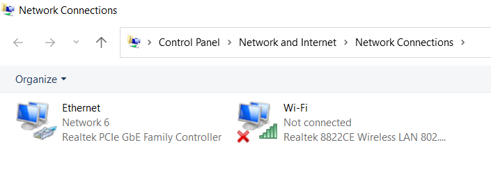
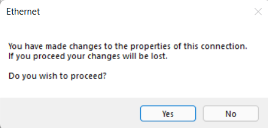
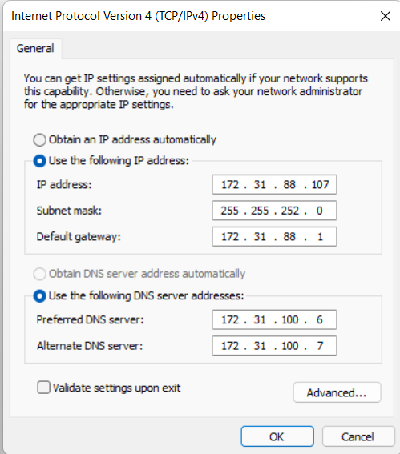
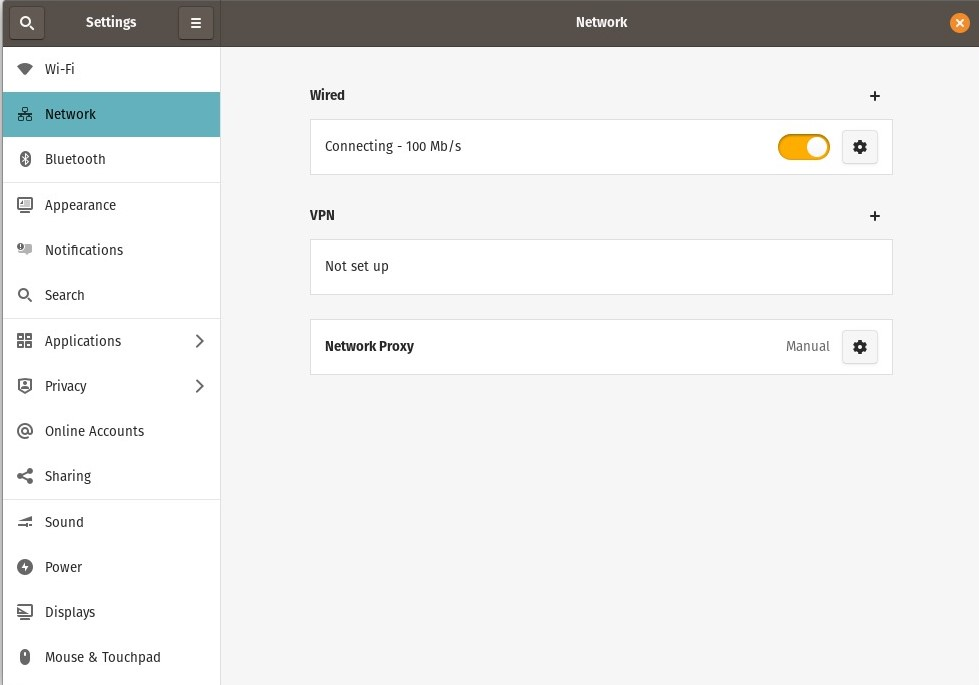
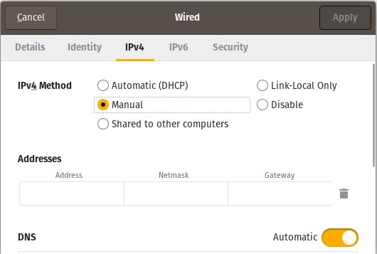
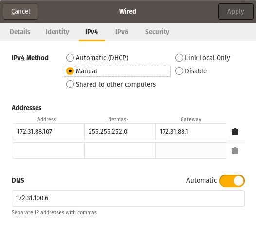
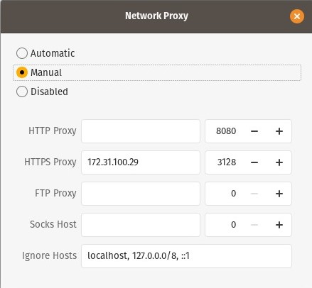

# Lan Configuration Settings 

Follow these steps to configure LAN connection in your pc.

## For Windows :
1. Add proxy in system proxy settings [Settings > Network & Internet > Proxy].

2. Press *win+R* key, and type **ncpa.cpl** on the dialog box that appears.

3. A new Window named network connections should open up. Double click on Ethernet Icon.

4. A new Dialog named Ethernet status will pop up. On it click on properties. Find the Internet Protocol Version 4 option as shown in the image and click on properties.

5. A pop up will appear. Click yes.

6. You will get a dialog box as shown in the image below.

7. Find the Ip address, subnet mask and default gateway for your room in this [PDF](tagore_ip.pdf). For Preferred and Alternate DNS Server, use the same address as mentioned in the image. Click Ok to save the settings.

 

## For Linux :

1. Find Wired Network in Settings and click on the settings icon.

2. A Dialog box similar to below image will show up. Select Ipv4 tab in it. In Ipv4 method choose manual.

3. Find the Ip address, subnet mask and default gateway for your room in this [PDF](tagore_ip.pdf). For DNS, use the same address as mentioned in the image. Click Apply to save the settings.

4. Now again click on Network Proxy as shown in step1. Adjust Settings to the same as shown in image below.

> Note - These Settings apply only to Tagore hostel.

