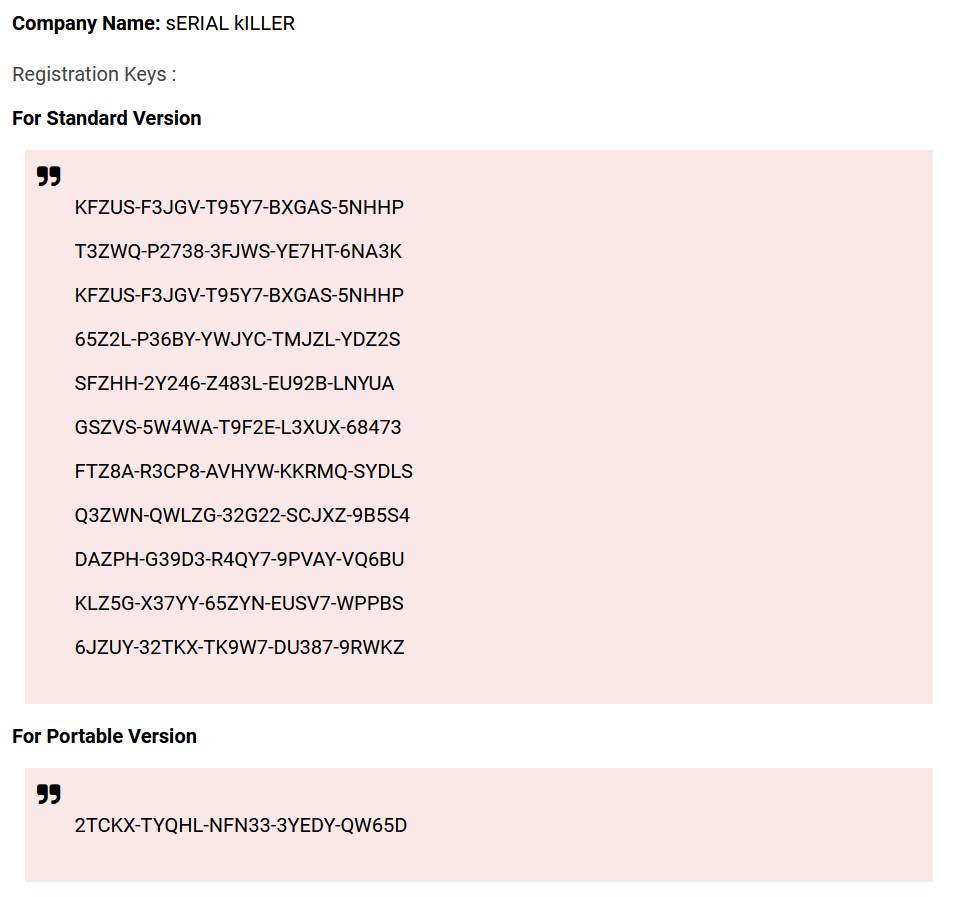
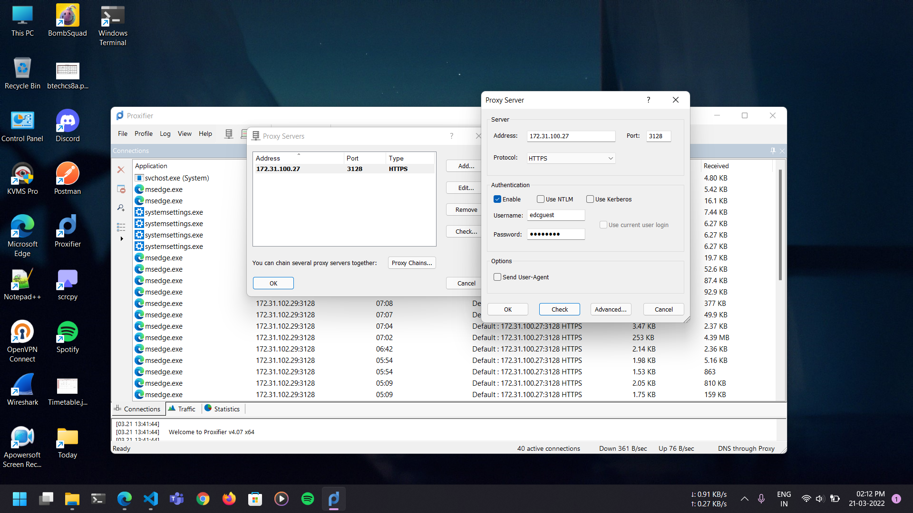
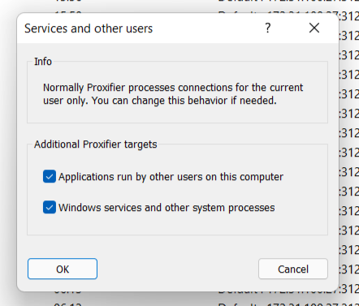
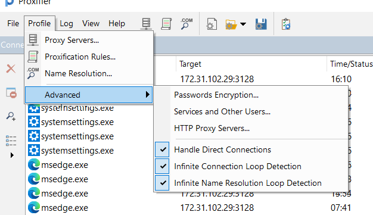

# Proxifier configuration

## Steps:

1. Get proxifier from [here](https://www.proxifier.com/) and install it. When asked for product key enter any key from the following image (taken from [here](https://onhax.io/cracked-pc-softwares/proxifier-registration-key/)):

   

2. Go to Profile > Proxy Servers and set it to following image:

   

3. Go to Profile > Advanced > Services and Other Users... and set it to following image:

   

4. In Profile > Advanced set it to:

   
